# Mastering Uncertainty in Performance Estimations of Configurable Software Systems

## Calibration Plots
The calibration plots below show 5 repetitions of each modl trained on a specific training set (t=1,2,3 in individual columns).

### Combined Calibration Plot [[PDF]](img/calibration-paper.pdf) [[PNG]](img/calibration-paper.png) 

I our paper, we included the calibration plot below, which aggregates the observed cofnidences and the MAPEci over all subject systems and all attributes.

[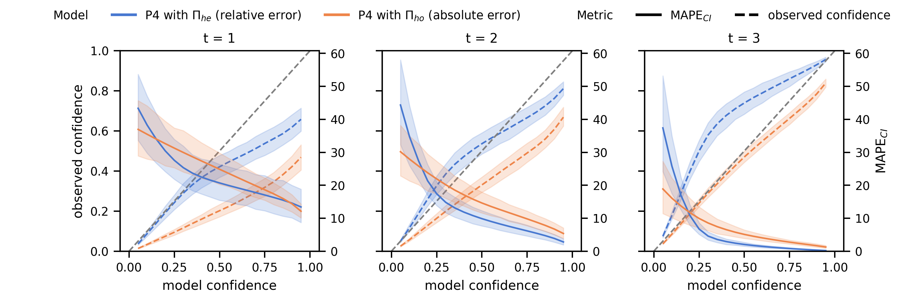](img/calibration-paper.png)

### Calibration Plot for Energy Only [[PDF]](img/calibration-energy-only.pdf) [[PNG]](img/calibration-energy-only.png) 

This plot contains only data on models that were trained to learn energy as performance.

[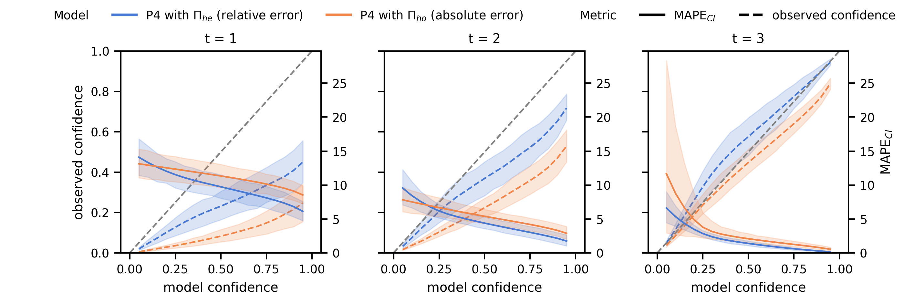](img/calibration-energy-only.png)

### Calibration Plot for Execution/Response Time Only [[PDF]](img/calibration-time-only.pdf) [[PNG]](img/calibration-time-only.png) 
This plot contains only data on models that were trained to learn execution time as performance.

[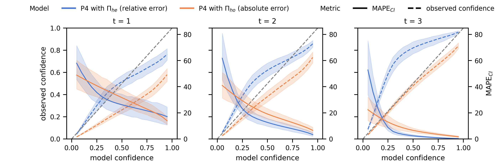](img/calibration-time-only.png)

### Calibration Plots for Individual Systems

For the rest of this page, we list calibration plots for all individual subject systems. We provide separate plots for each attribute (kind of performance) if the system there are measurements of both energy consumption and execution/response time.

#### 7-zip

##### Execution Time [[PDF]](img/calibration-combined-7z-Performance.pdf) [[PNG]](img/calibration-combined-7z-Performance.png) 

[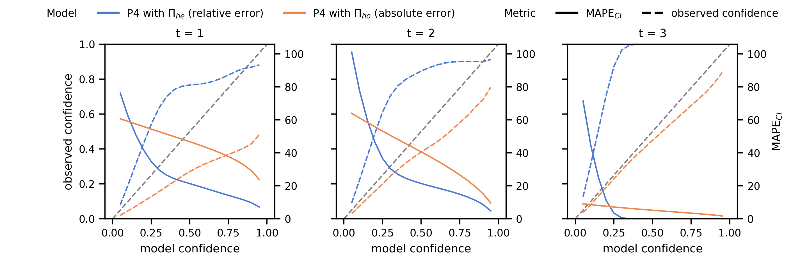](img/calibration-combined-7z-Performance.png)

#### BERKELEYDB-C (BDB-C)

##### Execution Time [[PDF]](img/calibration-combined-BerkeleyDBC-Performance.pdf) [[PNG]](img/calibration-combined-BerkeleyDBC-Performance.png) 

[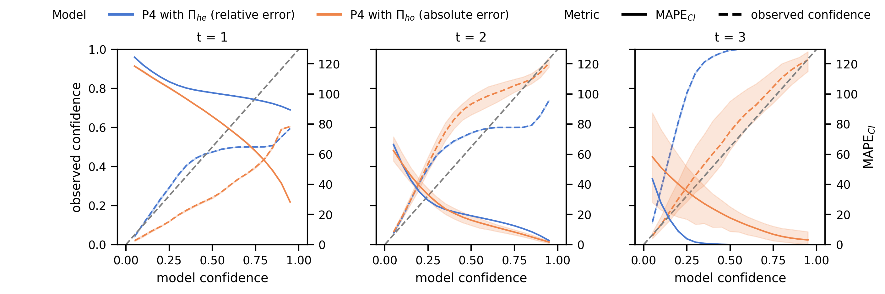](img/calibration-combined-BerkeleyDBC-Performance.png)

#### Dune MGS

##### Execution Time [[PDF]](img/calibration-combined-Dune-Performance.pdf) [[PNG]](img/calibration-combined-Dune-Performance.png) 

[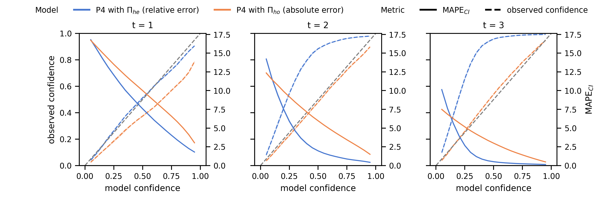](img/calibration-combined-Dune-Performance.png)

#### Hipacc

##### Execution Time [[PDF]](img/calibration-combined-Hipacc-Performance.pdf) [[PNG]](img/calibration-combined-Hipacc-Performance.png) 

[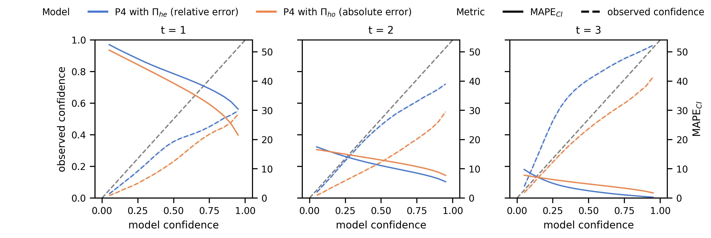](img/calibration-combined-Hipacc-Performance.png)

#### JavaGC

##### Execution Time [[PDF]](img/calibration-combined-JavaGC-Performance.pdf) [[PNG]](img/calibration-combined-JavaGC-Performance.png) 

[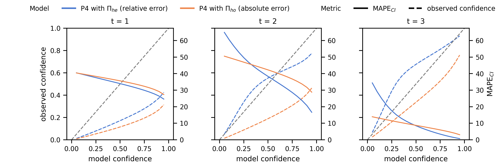](img/calibration-combined-JavaGC-Performance.png)

#### LLVM

##### Execution Time [[PDF]](img/calibration-combined-LLVM-Performance.pdf) [[PNG]](img/calibration-combined-LLVM-Performance.png) 

[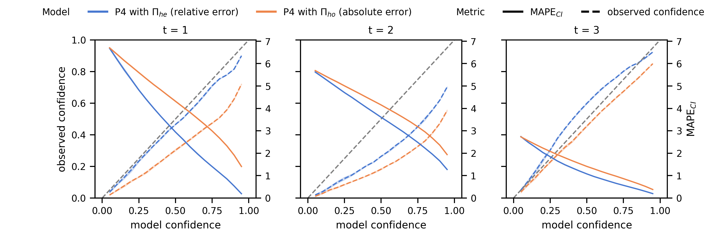](img/calibration-combined-LLVM-Performance.png)

##### Energy Consumption [[PDF]](img/calibration-combined-LLVM-energy.pdf) [[PNG]](img/calibration-combined-LLVM-energy.png) 

[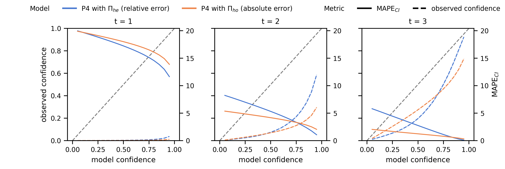](img/calibration-combined-LLVM-energy.png)

#### lrzip

##### Execution Time [[PDF]](img/calibration-combined-lrzip-Performance.pdf) [[PNG]](img/calibration-combined-lrzip-Performance.png) 

[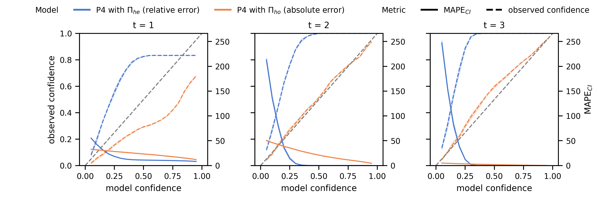](img/calibration-combined-lrzip-Performance.png)

#### Polly

##### Execution Time [[PDF]](img/calibration-combined-Polly-Performance.pdf) [[PNG]](img/calibration-combined-Polly-Performance.png) 

[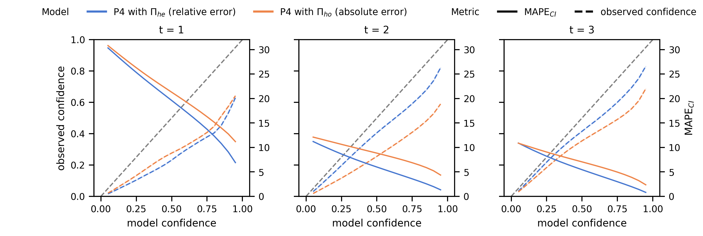](img/calibration-combined-Polly-Performance.png)

#### VP9

##### Execution Time [[PDF]](img/calibration-combined-VP9-ElapsedTime.pdf) [[PNG]](img/calibration-combined-VP9-ElapsedTime.png) 

[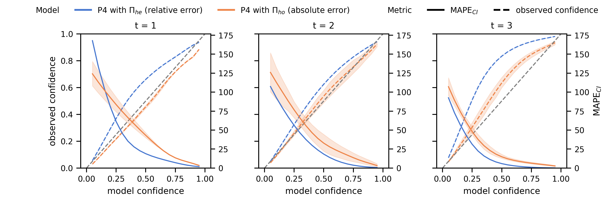](img/calibration-combined-VP9-ElapsedTime.png)

#### x264

##### Execution Time [[PDF]](img/calibration-combined-x264-Performance.pdf) [[PNG]](img/calibration-combined-x264-Performance.png) 

[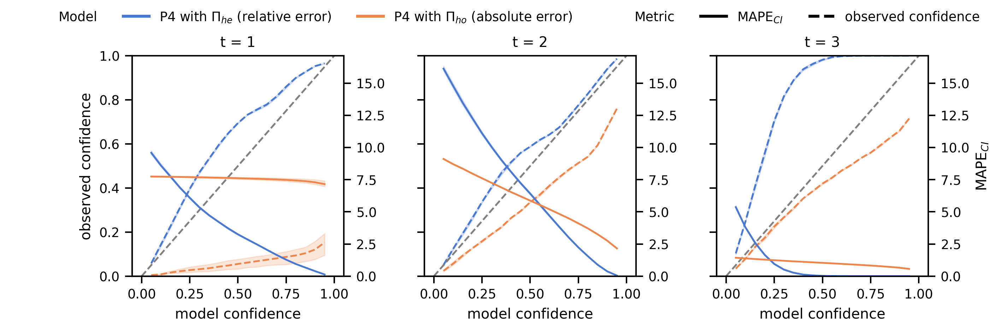](img/calibration-combined-x264-Performance.png)

##### Energy Consumption [[PDF]](img/calibration-combined-x264-benchmark-energy.pdf) [[PNG]](img/calibration-combined-x264-benchmark-energy.png) 

[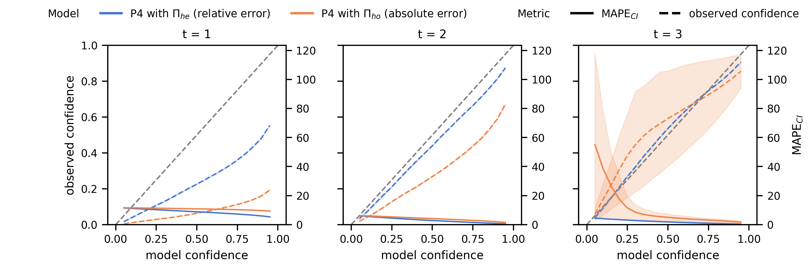](img/calibration-combined-x264-benchmark-energy.png)

---

#### HSQLDB

##### Energy Consumption [[PDF]](img/calibration-combined-HSQLDB-benchmark-energy.pdf) [[PNG]](img/calibration-combined-HSQLDB-benchmark-energy.png) 

[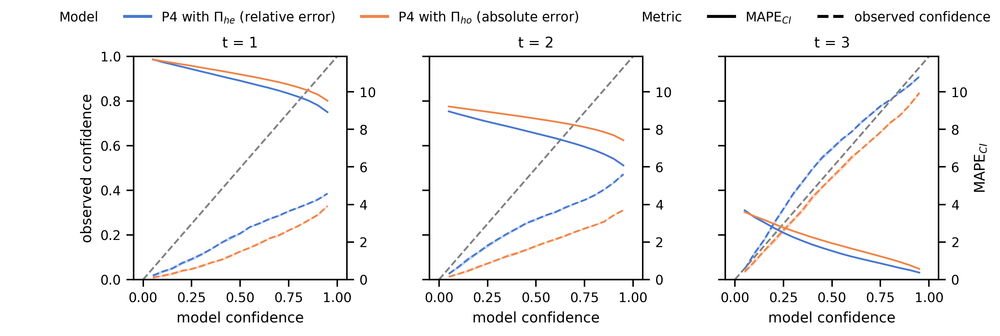](img/calibration-combined-HSQLDB-benchmark-energy.png)

#### PostgreSQL

##### Energy Consumption [[PDF]](img/calibration-combined-HSQLDB-benchmark-energy.pdf) [[PNG]](img/calibration-combined-HSQLDB-benchmark-energy.png) 

#### VP8

##### Energy Consumption [[PDF]](img/calibration-combined-VP8-energy.pdf) [[PNG]](img/calibration-combined-VP8-energy.png) 

[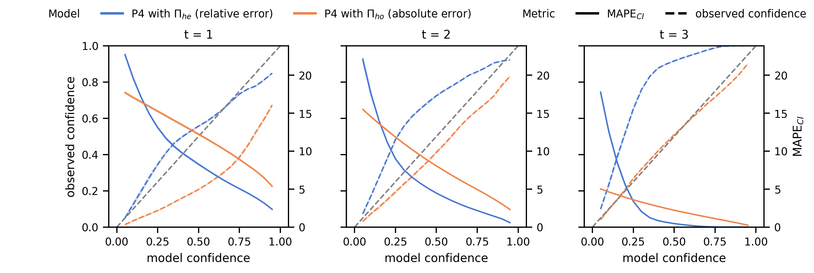](img/calibration-combined-VP8-energy.png)

[md-mape]: mape/README.md
[md-subject-systems]: ./systems/README.md
[md-calibration]: calibration/README.md
[md-main]: ./README.md