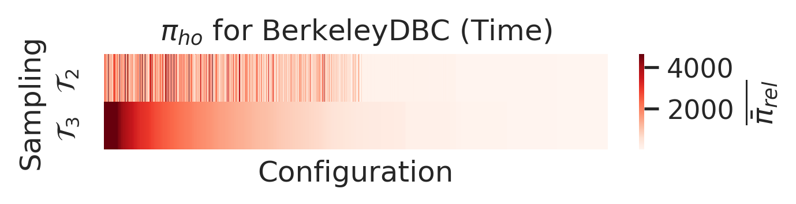

# Prediction confidence interval widths for models trained on T2 vs models trained on T3 

## 7-zip
### Execution Time  

  

---

## BERKELEYDB-C (BDB-C)
### Execution Time

  

--- 

## Dune MGS
### Execution Time 

  

---

## Hipacc
### Execution Time 

  

---

## JavaGC
### Execution Time 

  

---

## LLVM
### Execution Time 

  

---

### Energy Consumption 

  

---

## lrzip

### Execution Time 

  

---

## Polly

### Execution Time 

  

---

## VP9
### Execution Time 

  

---

## x264
### Execution Time 

  

---

### Energy Consumption 

  

---

## HSQLDB

### Energy Consumption 

  

---

## PostgreSQL

### Energy Consumption 

  

---

## VP8

### Energy Consumption 

  

[md-mape]: mape/README.md
[md-subject-systems]: ./systems/README.md
[md-calibration]: calibration/README.md
[md-main]: ./README.md