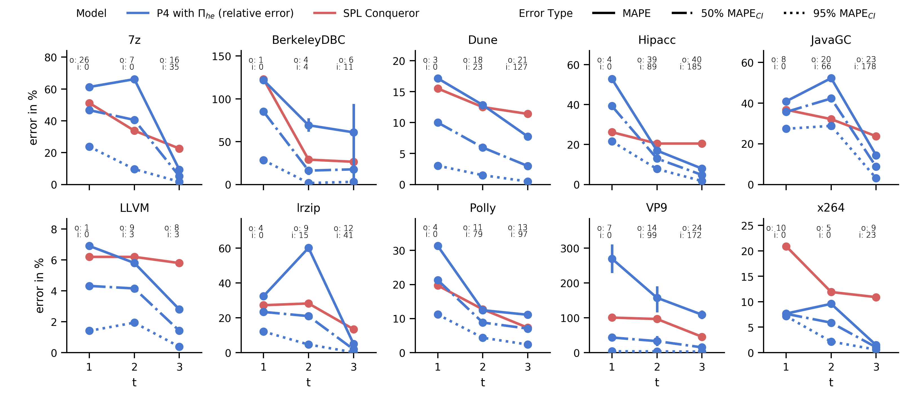
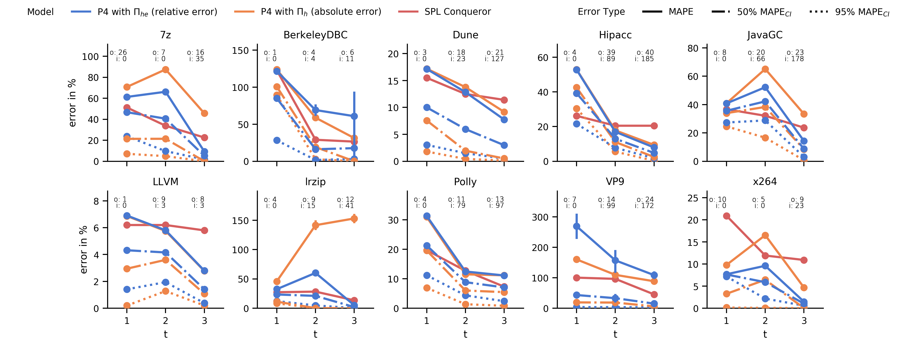

# Mastering Uncertainty in Performance Estimations of Configurable Software Systems

## RQ1 & RQ2:  MAPE Comparison

We compare our approach vs. SPL Conquerer, a state-of-the-art approach, in terms of point-estimate accuracy (soli lines). We also consider the accuracy when we use confidence intervals as predictions (dotted lines)

### MAPE Comparison Only Relative Errors [[PDF]](img/mape-paper.pdf) [[PNG]](img/mape-paper.png) 

This plot compares our approach when using a model with relative error with SPL Conquerer. For our approach, the plot illustrates the MAPE for the point estimate and for 95%-confidence and 50%-confidence intervals.

### MAPE Comparison With Absolute Error Models [[PDF]](img/mape-abs-rel.pdf) [[PNG]](img/mape-abs-rel.png) [[PDF-LARGE]](img/mape-abs-rel-enlarged.pdf) 
mape-abs-rel-enlarged
For comparison, we provide a plot that, in addition to the plot above, also includes approach when absolute errors are modeled (orange).

[md-mape]: mape/README.md
[md-subject-systems]: ./systems/README.md
[md-calibration]: calibration/README.md
[md-main]: ./README.md